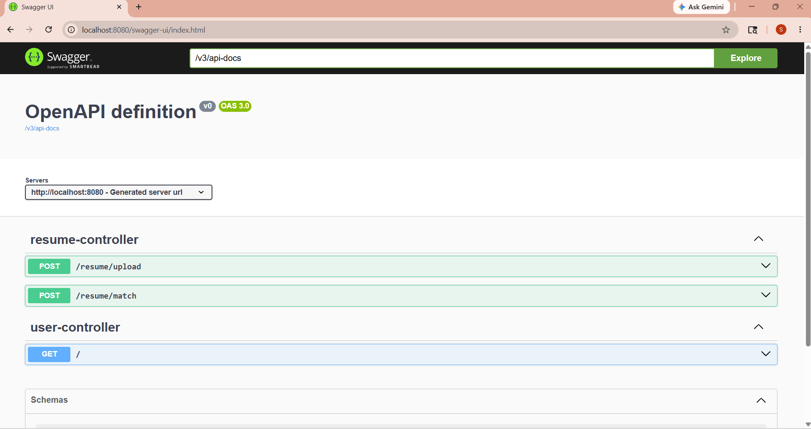
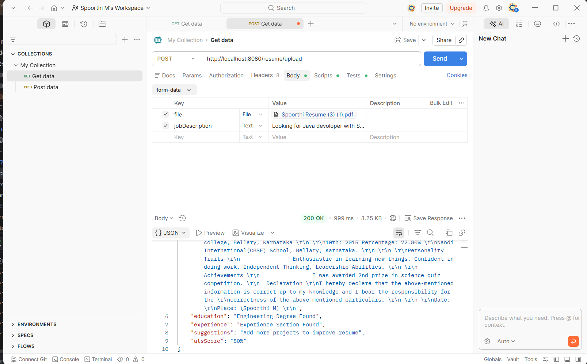

# AI Powered Resume Analyzer

## Overview
AI Powered Resume Analyzer is a Spring Boot based backend application that analyzes resumes uploaded in PDF formats.

The application extracts:
- Email
- Phone Number
- Skills
- Education
- Experience

It also:
- Calculates ATS score
- Matches resume with job description
- Identifies missing skills
- Generates recommendations

---

## Features

### Resume Upload API
- Upload PDF resume
- Extract resume text
- Detect skills automatically

### ATS Resume Analysis
- Calculate ATS score
- Suggest improvements
- Analyze education and experience

### Job Description Matching
- Compare resume with job description
- Calculate match percentage
- Identify missing skills

### Swagger API Documentation
- Interactive API testing UI

---

## Tech Stack

- Java
- Spring Boot
- REST APIs
- Maven
- PDFBox
- Swagger UI
- PostgreSQL
- Supabase

---

## API Endpoints

### Upload Resume
POST /resume/upload

### Match Resume
POST /resume/match

---

## Swagger UI

Open in browser:

http://localhost:8080/swagger-ui/index.html

---

## How to Run

1. Clone repository
2. Open project in IntelliJ
3. Configure database
4. Run ResumeAnalyzerApplication
5. Open Swagger UI

---

## Future Improvements

- AI powered suggestions using OpenAI/Gemini
- Frontend using React
- Resume history storage
- Authentication system
- Advanced ATS scoring

---
## Screenshots

### Swagger UI

### Resume Upload API

### Job Match API

## Author

Spoorthi M
